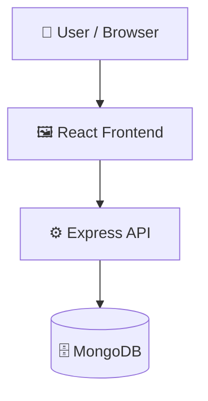

# Harit_Kranti

> Full-stack agricultural application for pest detection and user management.

    

## 📑 Table of Contents

- [Description](#description)
- [Key Features](#key-features)
- [Use Cases](#use-cases)
- [Tech Stack](#tech-stack)
- [Architecture](#architecture)
- [Quick Start](#quick-start)
- [Key Dependencies](#key-dependencies)
- [Available Scripts](#available-scripts)
- [Project Structure](#project-structure)
- [Development Setup](#development-setup)
- [Contributors](#contributors)
- [Contributing](#contributing)
- [License](#license)

## 📝 Description

Harit Kranti is a full-stack web application designed to support agricultural workflows through user management and pest identification services. The platform combines a Node.js and Express backend with a React client to process pest data and user records. The backend architecture utilizes Express.js and MongoDB, leveraging Multer for handling file uploads. It exposes RESTful API endpoints under /api/pest and /api/users, serves user-uploaded media from a static uploads directory, and integrates global error handling alongside HTTP request logging using Morgan.

## ✨ Key Features

- **🐛 Pest Management API Routes** — Provides dedicated RESTful routes under /api/pest for handling pest data.
- **👤 User Management Endpoints** — Exposes API endpoints under /api/users to handle user account operations.
- **🖼️ Static Media File Uploads** — Configures file handling and static asset serving for uploaded images via Express.
- **⚛️ React and Vite Client** — Includes a single-page frontend application built with React, Vite, and Tailwind CSS.

## 🎯 Use Cases

- Building a digital platform for agricultural pest tracking and reporting.
- Deploying a React and Express application with REST APIs and file upload capabilities.

## 🛠️ Tech Stack

      

**Notable libraries:** Mongoose, Multer

## 🏗️ Architecture

A high-level view of how the main pieces fit together:



## ⚡ Quick Start

```bash

# 1. Clone the repository
git clone https://github.com/abhiikyaa/Harit_Kranti.git

# 2. Install dependencies
bun install

# 3. Start the dev server
npm run dev
```

## 📦 Key Dependencies

```
@types/jsonwebtoken: ^9.0.10
axios: ^1.12.2
bcryptjs: ^3.0.2
cors: ^2.8.5
dotenv: ^17.2.2
express: ^5.1.0
jsonwebtoken: ^9.0.2
mongoose: ^8.18.1
morgan: ^1.10.1
multer: ^2.0.2
react: ^19.1.1
react-dom: ^19.1.1
```

## 🚀 Available Scripts

- **THIS_MAKEFILE_PATH** — `make THIS_MAKEFILE_PATH`
- **THIS_DIR** — `make THIS_DIR`
- **install** — `make install`
- **node_modules** — `make node_modules`
- **lint** — `make lint`
- **test-node** — `make test-node`
- **test-browser** — `make test-browser`
- **test** — `make test`
- **coveralls** — `make coveralls`

## 📁 Project Structure

```
.
├── backend
│   ├── package.json
│   ├── src
│   │   ├── app.ts
│   │   ├── config
│   │   │   └── db.ts
│   │   ├── controllers
│   │   │   ├── pestController.ts
│   │   │   └── userController.ts
│   │   ├── middleware
│   │   │   └── errorHandler.ts
│   │   ├── models
│   │   │   ├── User.ts
│   │   │   ├── pestResult.ts
│   │   │   └── pest_model.h5
│   │   ├── routes
│   │   │   ├── pest.js
│   │   │   ├── pestRoutes.ts
│   │   │   └── userRoutes.ts
│   │   ├── server.ts
│   │   ├── services
│   │   │   ├── geminiClient.js
│   │   │   ├── geminiService.ts
│   │   │   ├── mlModel.js
│   │   │   ├── pestService.ts
│   │   │   └── supabaseClient.js
│   │   ├── types
│   │   │   └── globals.d.ts
│   │   └── utils
│   │       └── upload.ts
│   └── tsconfig.json
├── harit-path-main
│   ├── components.json
│   ├── eslint.config.js
│   ├── index.html
│   ├── package.json
│   ├── postcss.config.js
│   ├── public
│   │   ├── favicon.ico
│   │   ├── placeholder.svg
│   │   └── robots.txt
│   ├── src
│   │   ├── App.css
│   │   ├── App.tsx
│   │   ├── assets
│   │   │   ├── WhatsApp Image 2025-09-18 at 18.48.58_de418c34.jpg
│   │   │   ├── WhatsApp Image 2025-09-19 at 06.18.06_46c59b7e.jpg
│   │   │   ├── WhatsApp Image 2025-09-19 at 06.18.06_e2b3ccdc.jpg
│   │   │   ├── WhatsApp Image 2025-09-19 at 06.18.06_ffb4111e.jpg
│   │   │   ├── WhatsApp Image 2025-09-19 at 06.18.07_2a030f59.jpg
│   │   │   ├── WhatsApp Image 2025-09-19 at 06.18.07_c217dfff.jpg
│   │   │   ├── WhatsApp Image 2025-09-19 at 06.38.03_614cb0be.jpg
│   │   │   ├── WhatsApp Image 2025-09-19 at 07.00.01_50543af8.jpg
│   │   │   ├── crops-hero.jpg
│   │   │   └── weather-icons.jpg
│   │   ├── components
│   │   │   ├── ChatAssistant.tsx
│   │   │   ├── Community.tsx
│   │   │   ├── Dashboard.tsx
│   │   │   ├── FarmCalendar.tsx
│   │   │   ├── MarketPrices.tsx
│   │   │   ├── OnboardingScreen.tsx
│   │   │   ├── PestDetection.tsx
│   │   │   ├── VoiceButton.tsx
│   │   │   ├── VoiceLanguageContext.tsx
│   │   │   ├── WeatherDetails.tsx
│   │   │   └── ui
│   │   │       ├── accordion.tsx
│   │   │       ├── alert-dialog.tsx
│   │   │       ├── alert.tsx
│   │   │       ├── aspect-ratio.tsx
│   │   │       ├── avatar.tsx
│   │   │       ├── badge.tsx
│   │   │       ├── breadcrumb.tsx
│   │   │       ├── button.tsx
│   │   │       ├── calendar.tsx
│   │   │       ├── card.tsx
│   │   │       ├── carousel.tsx
│   │   │       ├── chart.tsx
│   │   │       ├── checkbox.tsx
│   │   │       ├── collapsible.tsx
│   │   │       ├── command.tsx
│   │   │       ├── context-menu.tsx
│   │   │       ├── dialog.tsx
│   │   │       ├── drawer.tsx
│   │   │       ├── dropdown-menu.tsx
│   │   │       ├── form.tsx
│   │   │       ├── hover-card.tsx
│   │   │       ├── input-otp.tsx
│   │   │       ├── input.tsx
│   │   │       ├── label.tsx
│   │   │       ├── menubar.tsx
│   │   │       ├── navigation-menu.tsx
│   │   │       ├── pagination.tsx
│   │   │       ├── popover.tsx
│   │   │       ├── progress.tsx
│   │   │       ├── radio-group.tsx
│   │   │       ├── resizable.tsx
│   │   │       ├── scroll-area.tsx
│   │   │       ├── select.tsx
│   │   │       ├── separator.tsx
│   │   │       ├── sheet.tsx
│   │   │       ├── sidebar.tsx
│   │   │       ├── skeleton.tsx
│   │   │       ├── slider.tsx
│   │   │       ├── sonner.tsx
│   │   │       ├── switch.tsx
│   │   │       ├── table.tsx
│   │   │       ├── tabs.tsx
│   │   │       ├── textarea.tsx
│   │   │       ├── toast.tsx
│   │   │       ├── toaster.tsx
│   │   │       ├── toggle-group.tsx
│   │   │       ├── toggle.tsx
│   │   │       ├── tooltip.tsx
│   │   │       └── use-toast.ts
│   │   ├── hooks
│   │   │   ├── use-mobile.tsx
│   │   │   ├── use-toast.ts
│   │   │   └── useSpeech.ts
│   │   ├── index.css
│   │   ├── lib
│   │   │   └── utils.ts
│   │   ├── main.tsx
│   │   ├── pages
│   │   │   ├── Index.tsx
│   │   │   └── NotFound.tsx
│   │   ├── types
│   │   │   └── screens.ts
│   │   └── vite-env.d.ts
│   ├── tailwind.config.ts
│   ├── tsconfig.app.json
│   ├── tsconfig.json
│   ├── tsconfig.node.json
│   └── vite.config.ts
└── package.json
```

## 🛠️ Development Setup

### Node.js / JavaScript
1. Install Node.js (v18+ recommended)
2. Install dependencies: `npm install` (or `yarn` / `pnpm install` / `bun install`)
3. Start the dev server: see the **Quick Start** above

## 📜 License

This project is licensed under the **MIT** License.

---

